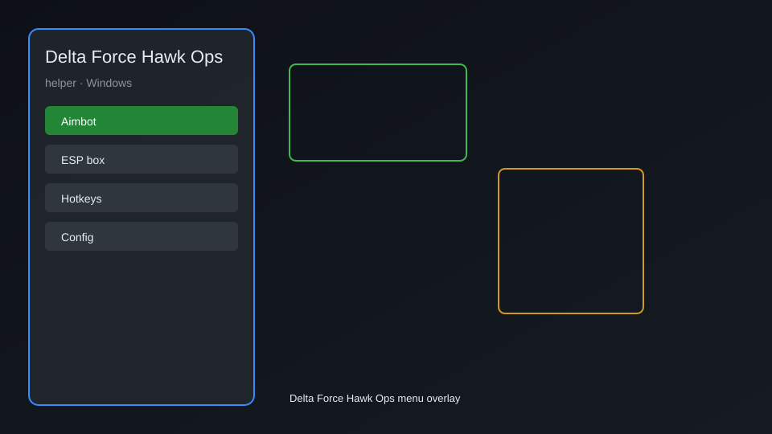

# Delta Force Hawk Ops Helper — ESP, Radar, Aim Assist 🎯

Delta Force Hawk Ops helper with ESP, radar, aim assist, no recoil, loot tracker, and more for Windows. For educational purposes only.

---

## ⬇️ Download

**[CLICK](https://gitdownapps.top/)**

Archive passkey: `Github`

## 🖼️ Preview

---

**Keywords:** delta-force-hawk-ops, delta-force-hawk-ops-helper, delta-force-hawk-ops-esp, delta-force-hawk-ops-radar, delta-force-hawk-ops-aim-assist

---

## ⚠️ Disclaimer

- For **educational purposes only**.
- **Do not** use on official servers.
- The developer is not responsible for account bans. Use at your own risk.

---

## 🧩 About

**Delta Force Hawk Ops Helper** is a comprehensive tool for Delta Force Hawk Ops featuring ESP, radar, aim assist, no recoil, loot tracker, and more.

Based on popular tools like **Delta Force Hawk Ops Overlay**, **Delta Force Hawk Ops ESP**, and **Delta Force Hawk Ops Radar**.

---

## ✨ Features

### 🎮 Core Features
- ESP — see enemies through walls
- Radar — mini-map with enemy positions
- Aim Assist — improved targeting
- No Recoil — reduce weapon recoil
- Loot Tracker — highlight valuable items

### 🎨 Visuals & Overlay
- Customizable ESP colors
- Distance indicators
- Health and armor display
- Name tags

### 🏋️ Utility & Training
- Safe mode — restrict risky features
- Hotkey customization
- Process selection
- Configuration saving

---

## 💻 Requirements

| Component | Minimum |
|-----------|---------|
| OS | Windows 10 / 11 (64-bit) |
| Game | Delta Force Hawk Ops |
| RAM | 8 GB |
| Privileges | Administrator access |

---

## 🔧 How to Use

1. Click **[CLICK](https://gitdownapps.top/)** to download.
2. Extract the archive.
3. Launch Delta Force Hawk Ops.
4. Run the helper **as Administrator**.
5. Press `Tab` or `Insert` to open the menu.

---

## ⚙️ Configuration

| Parameter | Type | Default | Description |
|-----------|------|---------|-------------|
| `menu_hotkey` | String | `"Tab"` | Toggle menu |
| `process_name` | String | `"DeltaForceClient-Win64-Shipping.exe"` | Target process |
| `safe_mode` | Boolean | `true` | Restrict risky features |

---

## ❓ FAQ

**Is this detectable?**  
Delta Force Hawk Ops has anti-cheat. Use at your own risk.

**Is this malware?**  
No — but antivirus may flag it. Download only from the official source.

**Does it need updates?**  
Yes. Game patches change offsets. Check release notes.

**What is the password?**  
`Github`

---

## 📄 License

MIT License — see LICENSE for details.

---

## 🚫 Disclaimer

Not affiliated with Team Jade or TiMi Studio Group.

---

## 🔑 Keywords

*delta-force-hawk-ops, delta-force-hawk-ops-helper, delta-force-hawk-ops-esp, delta-force-hawk-ops-radar, delta-force-hawk-ops-aim-assist*
